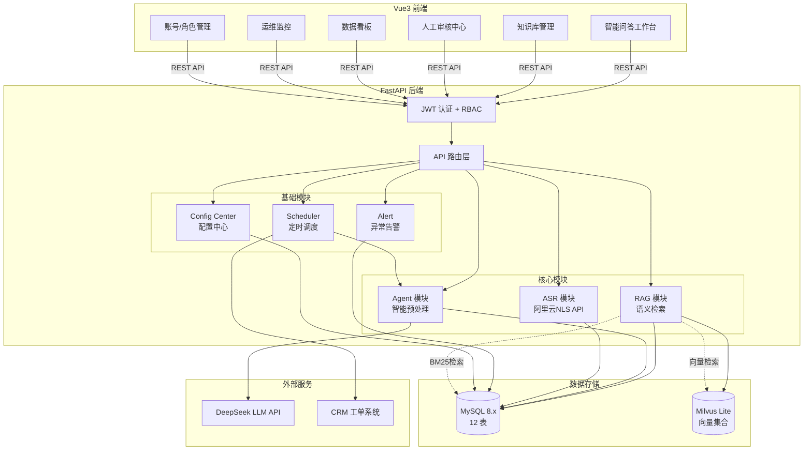
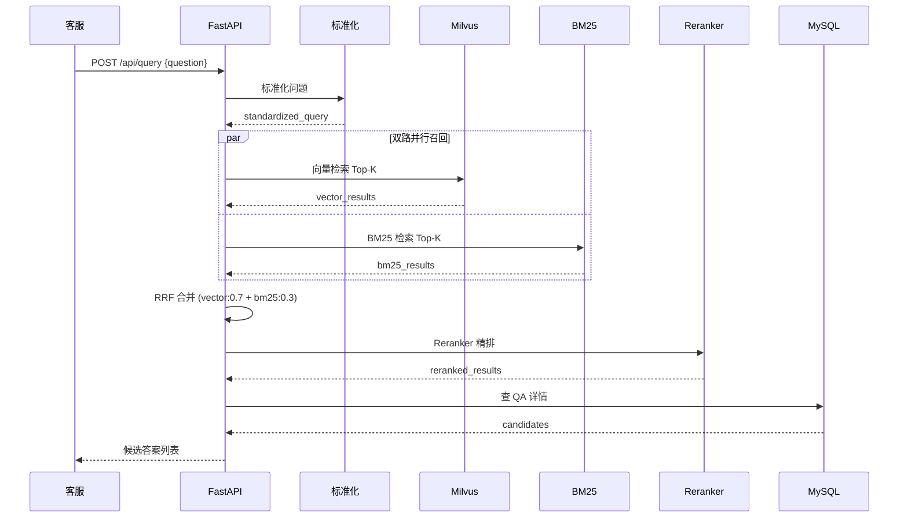
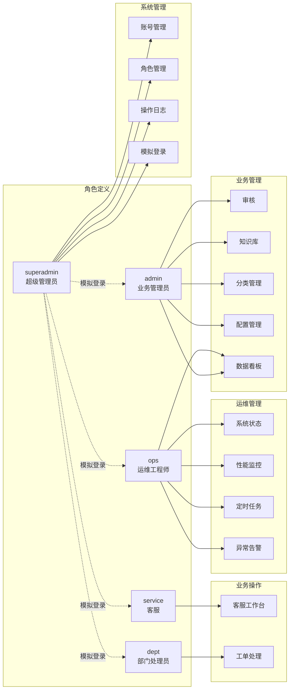
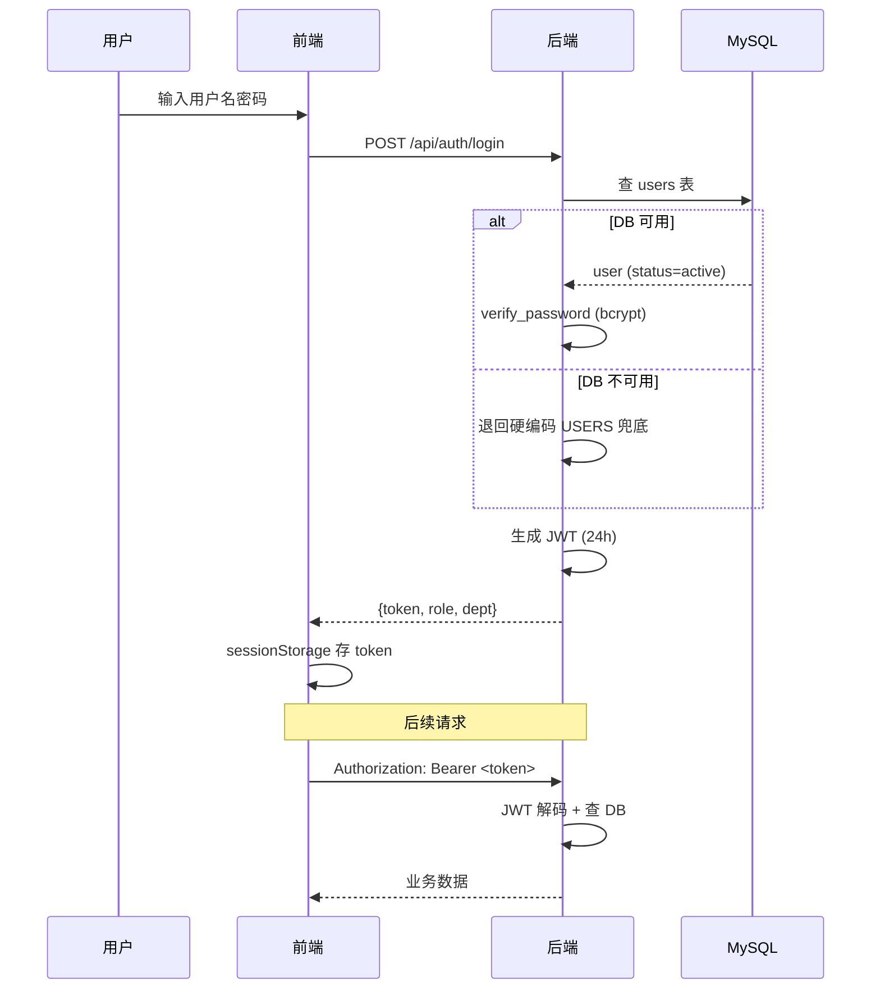
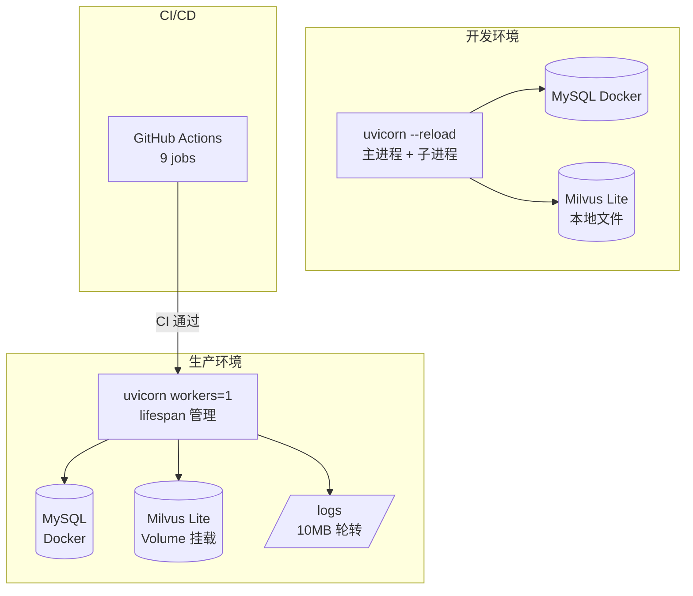
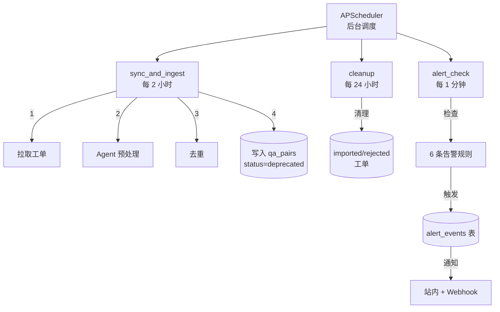
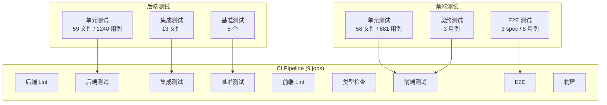

# 系统架构图（Mermaid 版）

> 本文件使用 Mermaid 语法，GitHub/VS Code 可直接渲染。原 ASCII 版见各架构图文件。

## 一、系统总体架构

```mermaid
graph TB
    subgraph 前端["Vue3 前端"]
        UI1[智能问答工作台]
        UI2[知识库管理]
        UI3[人工审核中心]
        UI4[数据看板]
        UI5[运维监控]
        UI6[账号/角色管理]
    end

    subgraph 后端["FastAPI 后端"]
        API[API 路由层]
        AUTH[JWT 认证 + RBAC]
        
        subgraph 核心模块
            ASR[ASR 模块<br/>阿里云NLS API]
            AGENT[Agent 模块<br/>智能预处理]
            RAG[RAG 模块<br/>语义检索]
        end
        
        subgraph 基础模块
            SCHED[Scheduler<br/>定时调度]
            ALERT[Alert<br/>异常告警]
            CONFIG[Config Center<br/>配置中心]
        end
    end

    subgraph 存储["数据存储"]
        MySQL[(MySQL 8.x<br/>12 表)]
        Milvus[(Milvus Lite<br/>向量集合)]
    end

    subgraph 外部["外部服务"]
        LLM[DeepSeek LLM API]
        CRM[CRM 工单系统]
    end

    UI1 & UI2 & UI3 & UI4 & UI5 & UI6 -->|REST API| AUTH
    AUTH --> API
    API --> ASR & AGENT & RAG & SCHED & ALERT & CONFIG
    
    RAG --> Milvus
    RAG --> MySQL
    AGENT --> LLM
    AGENT --> MySQL
    ASR --> MySQL
    SCHED --> CRM
    SCHED --> AGENT
    ALERT --> MySQL
    CONFIG --> MySQL
    
    RAG -.->|向量检索| Milvus
    RAG -.->|BM25检索| MySQL
```

## 二、RAG 检索数据流

```mermaid
sequenceDiagram
    participant C as 客服
    participant API as FastAPI
    participant STD as 标准化
    participant V as Milvus
    participant B as BM25
    participant R as Reranker
    participant DB as MySQL

    C->>API: POST /api/query {question}
    API->>STD: 标准化问题
    STD-->>API: standardized_query
    
    par 双路并行召回
        API->>V: 向量检索 Top-K
        V-->>API: vector_results
    and
        API->>B: BM25 检索 Top-K
        B-->>API: bm25_results
    end
    
    API->>API: RRF 合并 (vector:0.7 + bm25:0.3)
    API->>R: Reranker 精排
    R-->>API: reranked_results
    API->>DB: 查 QA 详情
    DB-->>API: candidates
    API-->>C: 候选答案列表
```

## 三、5 角色 RBAC 权限

```mermaid
graph LR
    subgraph 角色定义
        SA[superadmin<br/>超级管理员]
        AD[admin<br/>业务管理员]
        OP[ops<br/>运维工程师]
        SV[service<br/>客服]
        DP[dept<br/>部门处理员]
    end

    subgraph 系统管理
        ACCT[账号管理]
        ROLE[角色管理]
        LOG[操作日志]
        IMP[模拟登录]
    end

    subgraph 业务管理
        AUDIT[审核]
        KNOW[知识库]
        CAT[分类管理]
        CFG[配置管理]
        DASH[数据看板]
    end

    subgraph 运维管理
        STATUS[系统状态]
        MON[性能监控]
        SCHED[定时任务]
        ALERT[异常告警]
    end

    subgraph 业务操作
        WORK[客服工作台]
        DEPT[工单处理]
    end

    SA --> ACCT & ROLE & LOG & IMP
    SA -.->|模拟登录| AD & OP & SV & DP
    AD --> DASH & AUDIT & KNOW & CAT & CFG
    OP --> DASH & STATUS & MON & SCHED & ALERT
    SV --> WORK
    DP --> DEPT
```

## 四、认证流程

```mermaid
sequenceDiagram
    participant U as 用户
    participant FE as 前端
    participant BE as 后端
    participant DB as MySQL

    U->>FE: 输入用户名密码
    FE->>BE: POST /api/auth/login
    BE->>DB: 查 users 表
    alt DB 可用
        DB-->>BE: user (status=active)
        BE->>BE: verify_password (bcrypt)
    else DB 不可用
        BE->>BE: 退回硬编码 USERS 兜底
    end
    BE->>BE: 生成 JWT (24h)
    BE-->>FE: {token, role, dept}
    FE->>FE: sessionStorage 存 token
    
    Note over FE,BE: 后续请求
    FE->>BE: Authorization: Bearer <token>
    BE->>BE: JWT 解码 + 查 DB
    BE-->>FE: 业务数据
```

## 五、部署架构

```mermaid
graph TB
    subgraph 开发环境
        DEV[uvicorn --reload<br/>主进程 + 子进程]
        DEV_M[(MySQL Docker)]
        DEV_ML[(Milvus Lite<br/>本地文件)]
    end
    
    subgraph 生产环境
        PROD[uvicorn workers=1<br/>lifespan 管理]
        PROD_M[(MySQL<br/>Docker)]
        PROD_ML[(Milvus Lite<br/>Volume 挂载)]
        PROD_L[/logs<br/>10MB 轮转/]
    end
    
    subgraph CI/CD
        GH[GitHub Actions<br/>9 jobs]
    end
    
    GH -->|CI 通过| PROD
    DEV --> DEV_M & DEV_ML
    PROD --> PROD_M & PROD_ML & PROD_L
```

## 六、定时任务调度

```mermaid
graph TB
    SCHED[APScheduler<br/>后台调度]
    
    T1[sync_and_ingest<br/>每 2 小时]
    T2[cleanup<br/>每 24 小时]
    T3[alert_check<br/>每 1 分钟]
    
    SCHED --> T1 & T2 & T3
    
    T1 -->|1| CRM[拉取工单]
    T1 -->|2| AGENT[Agent 预处理]
    T1 -->|3| DEDUP[去重]
    T1 -->|4| DB[(写入 qa_pairs<br/>status=deprecated)]
    
    T2 -->|清理| DB2[(imported/rejected<br/>工单)]
    
    T3 -->|检查| RULES[6 条告警规则]
    RULES -->|触发| ALERT_DB[(alert_events 表)]
    ALERT_DB -->|通知| WEBHOOK[站内 + Webhook]
```

## 七、测试体系

```mermaid
graph TB
    subgraph 后端测试
        UT[单元测试<br/>59 文件 / 1240 用例]
        IT[集成测试<br/>13 文件]
        BT[基准测试<br/>5 个]
    end
    
    subgraph 前端测试
        FUT[单元测试<br/>58 文件 / 681 用例]
        E2E[E2E 测试<br/>3 spec / 8 用例]
        CT[契约测试<br/>3 用例]
    end
    
    subgraph CI["CI Pipeline (9 jobs)"]
        BL[后端 Lint]
        BUT2[后端测试]
        BIT[集成测试]
        BBT[基准测试]
        FL[前端 Lint]
        FTC[类型检查]
        FUT2[前端测试]
        FE2E[E2E]
        FB[构建]
    end
    
    UT --> BUT2
    IT --> BIT
    BT --> BBT
    FUT --> FUT2
    E2E --> FE2E
    CT --> FUT2
```